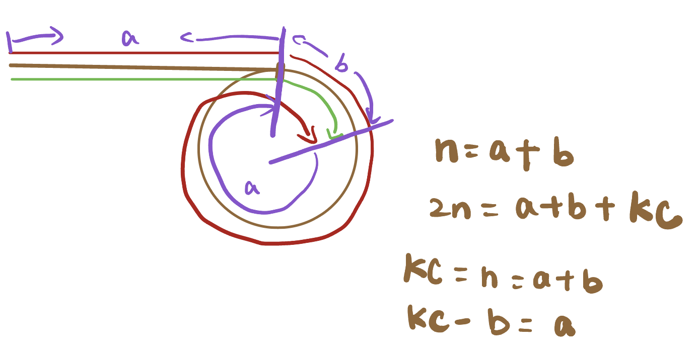
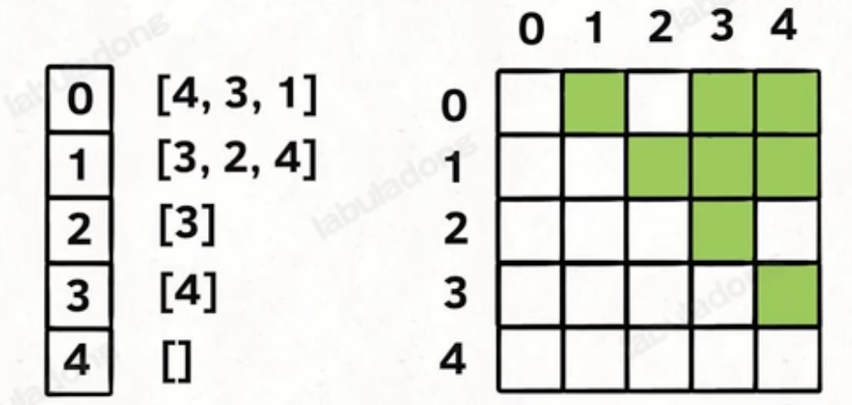

# Framework Thinking in Solving Algorithm Problems

## Basics

### Storage methods

底层的存储方式只有两种： Array (sequential storage) and linked list (linked storage)

Queue and stack can be implemented with both array and linked list, but need to deal with specific cases:

- Array
  - Continuous in memory, random access, quick access O(1)
  - Time complexity of resize, insertion and deletion: O(N)
  - Save memory
- Linked list
  - Time complexity of insertion/ deletion: O(1), no need to worry about resizing
  - No random access, need to iterate to access
  - Consumes more memory to store the pointers to next node

### Basic Manipulation :CURD/ Traverse + Access

- Ways to traverse: iteration(array), recursion(linked list, trees)

### Tips

- 虽然字符串⽀持⽤†+ 进⾏拼接，但是效率并不⾼，并不建议在†for 循环中使⽤。如果需要进⾏频繁的字符串拼接，推荐使⽤ StringBuilder

```java
StringBuilder sb = new StringBuilder();
for (char c = 'a'; c <= 'f'; c++) {
  sb.append(c);
}
// append ⽅法⽀持拼接字符、字符串、数字等类型
sb.append('g').append("hij").append(123);
```

- When comparing wrapper classes, use equals() instead of == (need to be aware when doing comparison in most data structures)

### Interfaces - Classes of Data Structures in Java

- Collection (extended by other interfaces in the following)
  - List
    - ArrayList: Implements a resizable array.
    - LinkedList: Implements a doubly linked list.
  - Set
    - HashSet: Implements a set using a hash table.
    - TreeSet: Implements a set using a self-balancing binary search tree.
  - Queue
    - LinkedList: Implements a queue using a linked list.
    - ArrayDeque: Implements a double-ended queue using an array.
  - Deque
    - ArrayDeque: Implements a double-ended queue using an array.
  - Map
    - HashMap: Implements a map using a hash table.
    - TreeMap: Implements a map using a self-balancing binary search tree.

```java
//Normal declaration syntax
List <Integer> nums = new ArrayList<>();
// use the class name after new keyword, but declare with the name of interface
```

# Linked List

- A common trick: add a dummy node at the beginning of the linked list, which can help to deal with the edge cases: empty list, list with only one node, etc.
- Where to use dummy node: when we need to create and return a new linked list, or when we need to modify the head of the linked list
- The common condition of while loop: `while (p1!=null && p2!=null)`

## Two-pointer Technique in Linked List

### Merge 2 sorted linked lists

1. Create a dummy node
2. Create 2 pointers, point to the head of each list
3. Compare the 2 values of the 2 pointers, add the smaller one to the dummy node, and move the pointer to the next node
4. Return the dummy node's next node

> [Leetcode 21. Merge Two Sorted Lists (Easy)](https://leetcode.com/problems/merge-two-sorted-lists/)

```java
class Solution {
    public ListNode mergeTwoLists(ListNode list1, ListNode list2) {
        ListNode p1 = list1, p2 = list2;
        ListNode dummy = new ListNode(-1), p = dummy;

        while (p1!=null && p2!=null) {
            if (p1.val <= p2.val) {
                p.next = p1;
                p1 = p1.next;
            }
            else {
                p.next = p2;
                p2 = p2.next;
            }
            p = p.next;
        }
        if (p1 == null) {
            p.next = p2;
        } else {
            p.next = p1;
        }
    return dummy.next;
    }
}
```

### Partition Linked List

Be sure to check if we have disconnected the last node of the list, otherwise it will cause an infinite loop (cycles in the list)

> [Leetcode 86. Partition List (Medium)](https://leetcode.com/problems/partition-list/)

```java
class Solution {
    public ListNode partition(ListNode head, int x) {
        ListNode dummy1 = new ListNode(-1), p1 = dummy1;
        ListNode dummy2 = new ListNode(-1), p2 = dummy2;
        ListNode p = head;
        while(p!=null) {
            if (p.val < x) {
                p1.next = p;
                p1 = p1.next;
            } else {
                p2.next = p;
                p2 = p2.next;
            }
            p = p.next;
        }
        p1.next = dummy2.next;
        p2.next = null;
        return dummy1.next;
    }
}
```

### Merge k sorted linked lists

- We can use PriorityQueue to solve this problem, which is a min heap.
- The point is to override the comparator of the PriorityQueue, so that it can compare the values of the nodes in the linked list.
- We add the head nodes to the PriorityQueue, and then poll the node with the smallest value, and add the next node of the polled node to the PriorityQueue.
- We can also have k pointers!

> [Leetcode 23. Merge k Sorted Lists (Hard)](https://leetcode.com/problems/merge-k-sorted-lists/)

```java
class Solution {
    public ListNode mergeKLists(ListNode[] lists) {
        ListNode dummy = new ListNode(-1), p = dummy;
        // Initialize the PriorityQueue with lambda expression
        PriorityQueue<ListNode> pq = new PriorityQueue<>((a,b) -> (a.val - b.val));
        for(ListNode head: lists) {
            if(head!=null) pq.add(head);
        }
        while(!pq.isEmpty()) {
            ListNode node = pq.poll();
            p.next = node;
            p = p.next;
            if (node.next!=null) pq.add(node.next);
        }
        return dummy.next;
    }
}
```

### The Kth node from the end

- Fast and slow pointers
- Let the fast pointer start from the head, and move k steps first, and then move the slow pointer and the fast pointer together until the fast pointer reaches null.

> [Leetcode 19. Remove Nth Node From End of List (Medium)](https://leetcode.com/problems/remove-nth-node-from-end-of-list/)

```java
class Solution {
    public ListNode removeNthFromEnd(ListNode head, int n) {
        ListNode dummy = new ListNode(-1), slow = dummy, fast = dummy;
        dummy.next = head;
        for(int i = 0; i < n; i++) {
            fast = fast.next;
        }
        // we need to find the element before the target element, so we want to terminate when fast.next == null instead of fast == null
        while (fast.next!=null) {
            fast = fast.next;
            slow = slow.next;
        }
        slow.next = slow.next.next;
        return dummy.next;
    }
}
```

### The middle node of the linked list

> [Leetcode 876. Middle of the Linked List (Easy)](https://leetcode.com/problems/middle-of-the-linked-list/)

```java
class Solution {
    public ListNode middleNode(ListNode head) {
        ListNode fast = head;
        ListNode slow = head;
        while(fast!=null && fast.next !=null) {
            slow = slow.next;
            fast = fast.next.next;
        }
        return slow;
    }
}
```

### Cycle in the linked list

- If there is a cycle in the linked list, then the fast pointer will eventually meet the slow pointer.

> [Leetcode 141. Linked List Cycle (Easy)](https://leetcode.com/problems/linked-list-cycle/)

```java
public class Solution {
    public boolean hasCycle(ListNode head) {
        ListNode fast = head;
        ListNode slow = head;
        // we need to check if fast.next == null, otherwise it will cause a null pointer exception
        while(fast!=null && fast.next !=null) {
            fast = fast.next.next;
            slow = slow.next;
            if(fast == null) return false;
            if(slow == fast) return true;
        }
        return false;
    }
}
```

- One more question: if there is a cycle in the linked list, how to find the start node of the cycle?
  1. Use the fast and slow pointers to find the meeting point of the two pointers: we can assume the distance from the head to the start node of the cycle is a, the distance from the start node of the cycle to the meeting point is b.
  2. Assume the slower pointer has traveled x, then the faster pointer has traveled 2x.
  3. Once the slow pointer enters the cycle, the fast pointer will chase the slow one within 1 cycle, so if the cycle has a length of c, then 2x - x = nc, so nc = x = a + b.
  4. So we can set the slow pointer to the head, and the fast pointer to the meeting point, and move them together, and they will meet at the start node of the cycle.
     

```java
public class Solution {
    public ListNode detectCycle(ListNode head) {
        ListNode fast = head;
        ListNode slow = head;
        while(fast!=null && fast.next!=null) {
            fast = fast.next.next;
            slow = slow.next;
            if (fast == slow) {
                // we need to set the fast pointer to the head, and move the fast and slow pointers together
                fast = head;
                break;
            }
        }
        // we need to consider all conditions that will terminate the while loop
        if (fast == null || fast.next == null) return null;
        while (fast!= slow) {
            fast = fast.next;
            slow = slow.next;
        }
        return fast;
    }
}
```

### Find the intersection node of two linked lists

- We can use two pointers to traverse the two linked lists, and if one pointer reaches the end of the linked list, we can set it to the head of the other linked list, and do the same thing for the other pointer. If there is an intersection node, the two pointers will meet at the intersection node.
- Another way to solve this problem is first traverse the two lists to get the lengths, and then traverse the longer list to make the two lists have the same distance to the end, then traverse the two lists together to find the intersection node.
- Beware we need to find the same node instead of the same value.

## Reverse Linked List with recursion

To use recursion, we need to clarify it's definition and the return value of our method.

### Reverse the whole linked list

```java
ListNode reverse(ListNode head) {
    if (head.next == null) return head;
    ListNode last = reverse(head.next);
    head.next.next = head;
    head.next = null;
    return last;
}
```

### Reverse the first N nodes

```java

```

## Reverse Linked List in k groups

## Judge palindrome linked list

# Arrays

## Prefix Sum

- An elegant way to solve problems that require to calculate the sum of a subarray, with time complexity of O(1) for each query.
- The idea is to calculate the prefix sum of the array, and store the sum in a new array. Then we can get the sum of any subarray by calculating the difference between the prefix sum of the end index and the start index.
- For example, if we want sum of subarray [i, j], we can get it by prefixSum[j] - prefixSum[i-1]

### Prefix Sum Problem in 1d-array

> [Leetcode 303. Range Sum Query - Immutable (Easy)](https://leetcode.com/problems/range-sum-query-immutable/)

```java
class NumArray {
    private int[] nums;
    private int[] prevs;
    public NumArray(int[] nums) {
        this.nums = nums;
        // Detail: we need to initialize the prevs array with length of nums.length + 1, because we need to store the sum of the first i elements in prevs[i]
        prevs = new int[nums.length+1];
        prevs[0] = 0;
        for(int i = 1; i < prevs.length; i++) {
            prevs[i] = prevs[i-1] + nums[i-1];
        }
    }

    public int sumRange(int left, int right) {
        return prevs[right + 1] - prevs[left];
    }
}
```

### Prefix Sum Problem in 2d-array

> [Leetcode 304. Range Sum Query 2D - Immutable (Medium)](https://leetcode.com/problems/range-sum-query-2d-immutable/)

- For any area in the 2d-array, we can convert it to the result of calculations of 4 areas starting from [0,0].

```java
class NumMatrix {
    private int[][] matrix;
    private int[][] prev;
    public NumMatrix(int[][] matrix) {
        this.matrix = matrix;
        int r = matrix.length;
        int c = matrix[0].length;
        prev = new int[r+1][c+1];
        for(int i = 1; i <= r; i++) {
            for(int j = 1; j <= c; j++) {
                prev[i][j] = prev[i-1][j] + prev[i][j-1] - prev[i-1][j-1] + matrix[i-1][j-1];
            }
        }
    }

    public int sumRegion(int row1, int col1, int row2, int col2) {
        return prev[row2 + 1][col2 + 1] - prev[row1][col2 + 1] - prev[row2 + 1][col1] + prev[row1][col1];
    }
}
```

## Difference Array

- Difference array is an array that stores the difference between adjacent elements in the original array. We can transfer between the original array and the difference array by the following formula:
  - diff[i] = nums[i] - nums[i-1]
  - nums[i] = diff[i] + nums[i-1]
- When we need to update a range of elements in the original array, we can update the difference array instead, which is much faster.
- For example, if we want to increment all the elements in the range [i, j] by 1, we can update the difference array by:
  - diff[i] += 1
  - diff[j+1] -= 1 // Only when j+1 is in the range of the difference array

### Difference Array Problem

> [Leetcode 1109. Corporate Flight Bookings (Medium)](https://leetcode.com/problems/corporate-flight-bookings/)

```java
class Solution {
    public int[] corpFlightBookings(int[][] bookings, int n) {
        int[] res = new int[n];
        int[] diff = new int[n];
        for(int[] record: bookings) {
            diff[record[0] - 1] += record[2];
            // Only when j+1 is in the range of the difference array
            if(record[1] < n) diff[record[1]] -= record[2];
        }
        res[0] = diff[0];
        for(int i = 1; i < n; i++) {
            res[i] = res[i-1] + diff[i];
        }
        return res;
    }
}
```

## Tricks in 2d-array problems

### Rotate 90 degrees

Intuition: rotate 90 degrees means elements in the same row will be in the same column in the new array, and the order will be reversed.

- So our first step: reverse the 2d-array symmetrically
- Second step: reverse the elements in each row

The time complexity is O(n^2), space complexity is O(1)

> [Leetcode 48. Rotate Image (Medium)](https://leetcode.com/problems/rotate-image/)
> Solve the problem in place, that is, without using extra space.

- Pay attention to the index of the matrix, and the boundary of the matrix. If we swap all the indices, we will get the original matrix.

```java
class Solution {
    public void rotate(int[][] matrix) {
        int n = matrix.length;
        for(int i = 0; i < n; i++) {
          // j = i, because we only need to swap the upper triangle of the matrix
            for (int j = i; j < n; j++) {
                int temp = matrix[i][j];
                matrix[i][j] = matrix[j][i];
                matrix[j][i] = temp;
            }
        }
        for(int p = 0;  p < n; p++) {
          // k < n/2, because we only need to swap the left half of the matrix
            for (int k = 0;  k < n/2; k++) {
                int temp = matrix[p][k];
                matrix[p][k] = matrix[p][matrix.length - 1 - k];
                matrix[p][matrix.length - 1 - k] = temp;
            }
        }
    }
}
```

### Rotate 180 degrees

- First step: reverse the elements in each row
- Second step: reverse the elements in each column

## Spiral Matrix Problems

- Spiral matrix means the elements are arranged in a spiral order, like the following. We need to find a proper way to traverse the matrix.

- We do it by dynamically changing the boundaries of the matrix, and use four variables to represent the boundaries: left, right, top, bottom.

```bash
1 2 3
8 9 4
7 6 5
```

> [Leetcode 54. Spiral Matrix (Medium)](https://leetcode.com/problems/spiral-matrix/)

```java
public List<Integer> spiralOrder(int[][] matrix) {
  int m = matrix.length, n = matrix[0].length;
  int top = 0, left = 0, bottom = m - 1, right = n - 1;
  List<Integer> res = new ArrayList<>();
  // if not all the elements are added to the list, continue the loop to traverse elements from top to bottom, right to left, bottom to top, left to right...
  while (res.size() < m * n) {
      // traverse the top row
      if (top<=bottom) {
          for(int i = left; i <= right; i++) {
              res.add(matrix[top][i]);
          }
          top++;
      }
      // traverse the right column
      if (left<=right) {
          for(int j = top; j <= bottom; j++) {
              res.add(matrix[j][right]);
          }
          right--;
      }
      // traverse the bottom row
      if (top<=bottom) {
          for(int p = right; p >=left; p--) {
              res.add(matrix[bottom][p]);
          }
          bottom--;
      }
      // traverse the left column
      if (left<=right) {
          for(int k = bottom; k >= top; k--) {
              res.add(matrix[k][left]);
          }
          left++;
      }
  }
  return res;
}
```

## Sliding Window Problems

A special case of 2 pointers. We have right and left pointers. First we use the right pointer to expand the window, and then use the left pointer to shrink the window. We need to find the maximum/ minimum/ average/ sum of the elements in the window.

### Framework of sliding window problems

- Time complexity: O(n)
- If all possible values are lower/ upper bounded, we can use an array of size 26 to represent the window, and use a counter to represent the number of elements in the window, which would be more efficient than using a hashmap.

```java

/* 滑动窗口算法框架 */
void slidingWindow(String s) {
    // 用合适的数据结构记录窗口中的数据
    HashMap<Character, Integer> window = new HashMap<>();

    int left = 0, right = 0;
    while (right < s.length()) {
        // c 是将移入窗口的字符
        char c = s.charAt(right);
        window.put(c, window.getOrDefault(c, 0) + 1);
        // 增大窗口
        right++;
        // 进行窗口内数据的一系列更新
        // 判断左侧窗口是否要收缩, 条件可能根据具体情况有所不同
        while (left < right && window needs shrink) {
            // d 是将移出窗口的字符
            // Before shrinking the window, we need to update the result if necessary
            char d = s.charAt(left);
            window.put(d, window.get(d) - 1);
            // 缩小窗口
            left++;
            // 进行窗口内数据的一系列更新
            ...
        }
    }
}
```

### Problems

> [Leetcode 76. Minimum Window Substring (Hard)](https://leetcode.com/problems/minimum-window-substring/)

```java
class Solution {
    public String minWindow(String s, String t) {
       // Since s and t can be in lower and upper case, and the frequencies can be more than 1,we need to use an hashmap to store the characters and their frequencies
        Map<Character, Integer> window = new HashMap<>();
        Map<Character, Integer> need = new HashMap<>();
        for(char c: t.toCharArray()) {
            need.put(c, need.getOrDefault(c, 0) + 1);
        }
        int left = 0, right = 0, start = 0, valid = 0;
        // As we need to find the minimum, we initialize the length of the window to be the maximum value
        int len = Integer.MAX_VALUE;
        while (right < s.length()) {
            char d = s.charAt(right);
            right ++;
            if(need.containsKey(d)) {
                window.put(d, window.getOrDefault(d, 0) + 1);
                // Increment the number of valid characters in the window if the frequency in the window is equal to the frequency in the target string
                if (need.get(d).equals(window.get(d))) valid++;
            }
            while (valid == need.size()){
                // Update the result if necessary
                if (right - left < len) {
                    start = left;
                    len = right - left;
                }
                char e = s.charAt(left);
                left ++;
                if(need.containsKey(e)) {
                    if(need.get(e).equals(window.get(e))) valid--;
                    window.put(e, window.get(e) - 1);
                }
            }
        }
        // If the length of the window is still the maximum value, it means that there is no such window, so return an empty string
        // The 'right' pointer has already been incremented, so we exclude it from the substring we return
        return len == Integer.MAX_VALUE? "": s.substring(start, start + len);

    }
}
```

> [Leetcode 567. Permutation in String (Medium)](https://leetcode.com/problems/permutation-in-string/)

- Another example of sliding window problem: the window length is fixed, and we need to find if at least one window is valid.
- Pay attention to the shrinking condition: when the length of the window is equal to the length of the target string, we need to shrink the window.

```java
class Solution {
    public boolean checkInclusion(String s1, String s2) {
        // Initialize 2 int arrays to store frequencies of characters in our target and our window
        int[] need = new int[26], window = new int[26];
        // Our target int array
        for(char c:s1.toCharArray()) need[c-'a']++;
        int left = 0, right = 0;
        // Check our window until the end of the array
        while(right < s2.length()) {
            char d = s2.charAt(right);
            right++;
            // If the character exists in our target, increase the corresponding element in our window
            if(need[d-'a']!=0) window[d-'a']++;
            // When the length of window equals our target string
            if(right - left == s1.length()) {
                // Check if the frequencies of chars in target and our window are equal
                if (areArraysEqual(need,window)) return true;
                // Shrink our window and update the frequencies in our window array
                char e = s2.charAt(left);
                left++;
                // If the char to be excluded is in our target, decrease the frequency
                if(need[e-'a']!=0) window[e-'a']--;
            }
        }
        return false;
    }
    // Helper method to judge if 2 int arrays are equal
    public boolean areArraysEqual(int[] arr1, int[] arr2) {
        for (int i = 0; i < arr1.length; i++) {
            if (arr1[i] != arr2[i]) {
                return false;
            }
        }
    return true;
    }
}
```

> [Leetcode 438. Find All Anagrams in a String (Medium)](https://leetcode.com/problems/find-all-anagrams-in-a-string/)

- As we want all chars in the window to be unique, we don't need to store the frequencies of chars in the window. Instead, we can use a set to store the chars in the window.
- If there's a duplicate char, it must be the one that we just added to the window. So we can shrink the window until the duplicate char is removed.
- We update the length of the window when we add a new unique char to the window, and we want the maximum length of the window.

```java
class Solution {
    public int lengthOfLongestSubstring(String s) {
        Set<Character> window = new HashSet<>();
        int left = 0, right = 0, res = 0;
        while(right < s.length()) {
            char c = s.charAt(right);
            if(!window.contains(c)) {
                window.add(c);
                right++;
                res = Math.max(res, right - left);
            } else {
                window.remove(s.charAt(left));
                left++;
            }
        }
        return res;
    }
}
```

## Binary Search

There are many details in writing binary search algorithm. Here we list some common mistakes that we should avoid.

- To avoid overflow, we should use `int mid = left + (right - left) / 2` instead of `int mid = (left + right) / 2`.
- Depending on whether to include `right` in the search range, we should use 2 different conditions.
  - When `right` is included
  ```java
  // Initialize right to be the last index of the array
  int right = nums.length - 1;
  // Set the condition to be left <= right, so when left == right, we still have one element to check
  while(left <= right) {
      int mid = left + (right - left) / 2;
      if(nums[mid] == target) {
          return mid;
      } else if(nums[mid] < target) {
          left = mid + 1;
      } else {
          // Update right to be mid - 1, so we can exclude mid from the search range
          right = mid - 1;
      }
  }
  ```
  - When `right` is excluded
  ```java
  // Initialize right to be the length of the array
  int right = nums.length;
  // Set the condition to be left < right, so when left == right, we have checked all elements in the array
  while(left < right) {
      int mid = left + (right - left) / 2;
      if(nums[mid] == target) {
          return mid;
      } else if(nums[mid] < target) {
          left = mid + 1;
      } else {
          // Update right to be mid, so we can exclude mid from the search range
          right = mid;
      }
  }
  ```
  There's a framework of binary search algorithm that we can follow.

```java
int left = 0;
int right = nums.length - 1;
while(left<=right) {
  int mid = left + (right - left) / 2;
  if(nums[mid] == target) {
    ...
  } else if(nums[mid] < target) {
    ...
  } else if (nums[mid] > target){
    ...
  }
}

```

### Find the target and return its index

> [Leetcode 704. Binary Search (Easy)](https://leetcode.com/problems/binary-search/)

```java
class Solution {
    public int search(int[] nums, int target) {
        int left = 0, right = nums.length - 1;
        while(left <= right) {
            int mid = left + (right - left) / 2;
            if(nums[mid] == target) {
                return mid;
            } else if(nums[mid] < target) {
                left = mid + 1;
            } else {
                right = mid - 1;
            }
        }
        return -1;
    }
}
```

### Find the first target and return its index

- One condition to return -1: `left == nums.length`, which means that we have checked all elements in the array and the target is not found.
- The other condition to return -1: `nums[left] != target`, which means that we can find the position of the target in the array, but the target is not found.
- Pay attention: when `nums[mid] == target`, we should update `right` instead of returning immediately, because we want to find the first target.

### Find the last target and return its index

- When `nums[mid] == target`, we should update `left` to be `mid + 1`
- The conditions of returning -1 are similar to the previous question. This time we check `right` instead of `left`, whether `right ` is equal to `-1` or `nums[right] != target`.

> [Leetcode 34. Find First and Last Position of Element in Sorted Array (Medium)](https://leetcode.com/problems/find-first-and-last-position-of-element-in-sorted-array/)
> 💡 In this problem, we need to pay attention to check whether `nums[left/right] == target` and whether left/right is out of bound

```java
class Solution {
    public int[] searchRange(int[] nums, int target) {
        int leftBound = findLeft(nums, target);
        int rightBound = findRight(nums, target);
        return new int[]{leftBound, rightBound};
    }
    public int findLeft(int[] nums, int target) {
        int left = 0;
        int right = nums.length - 1;
        while(left <= right) {
            int mid = left + (right - left)/2;
            if (nums[mid] < target) left = mid + 1;
            else right = mid - 1;
        }
        return left > nums.length - 1 || nums[left] != target? -1: left;
    }

    public int findRight(int[] nums, int target) {
        int left = 0;
        int right = nums.length - 1;
        while (left <= right) {
            int mid = left + (right - left)/2;
            if (nums[mid] <= target) left = mid + 1;
            else right = mid - 1;
        }
        return right < 0 || nums[right] != target? -1: right;
    }
}

```

### Binary Search in non-array problems

- Binary search can be used in non-array problems as well. As long as we know the result lies in a certain range with a monotonic property, we can use binary search to find the result.
  > [Leetcode 69. Sqrt(x) (Easy)](https://leetcode.com/problems/sqrtx/)

```java
class Solution {
    public int mySqrt(int x) {
        int left = 0, right = x;
        while(left <= right) {
            int mid = left + (right - left) / 2;
            // as mid is the divisor, we need to check if it is 0
            if (mid == 0) return right;
            // we need to use x / mid to avoid overflow
            if (mid == x/mid) return mid;
            if (mid < x/mid) left = mid + 1;
            else right = mid - 1;
        }
        // as we want the floor of the square root, we return right(which is smaller when the loop terminates)
        return right;
    }
}
```

> [Leetcode 875. Koko Eating Bananas (Medium)](https://leetcode.com/problems/koko-eating-bananas/)
> 💡 We can solve this kind of problem by convert the result as a parameter of another function, and use binary search to find the the maximum/minimum value that satisfies the condition.

```java
class Solution {
    public int minEatingSpeed(int[] piles, int h) {
        Arrays.sort(piles);
        int n = piles.length;
        int lo = 1;
        int hi = piles[n-1];
        while(hi >= lo) {
            int mid = lo + (hi-lo) / 2;
            if (getHour(piles, mid) > h) lo = mid + 1;
            else if (getHour(piles, mid) <= h) hi = mid - 1;
        }
        // it's like find the first target, so we return lo
        return lo;
    }

    // we want the minimum speed when hours is given, so we add a new function to calculate the hours when speed is given
    public int getHour(int[] piles, int speed) {
        int hours= 0;
        for(int pile:piles) {
            hours += Math.ceil((double)pile/speed);
        }
        return hours;
    }
}

```

> [Leetcode 2616. Minimum Limit of Balls in a Bag (Hard)](https://leetcode.com/problems/minimum-limit-of-balls-in-a-bag/)
> 💡 This problem is like koko eating bananas, we are to find the minimum of biggest diff given the pair, so we write a helper function which can calculate the pair based on our result.

```java
class Solution {
    public int minimizeMax(int[] nums, int p) {
        if (p==0) return 0;
        Arrays.sort(nums);
        int lo = 0, n = nums.length, hi = nums[n-1] - nums[0];
        while(lo <= hi) {
            int mid = lo + (hi - lo) / 2;
            // if the number of pairs is greater than p, we can decrease the maximum difference
            if (solve(nums, mid, p)) hi = mid - 1;
            // if the number of pairs is less than p, we need to increase the maximum difference
            else lo = mid + 1;
        }
        // return the left boundary
        return lo;
    }

    public boolean solve (int[] nums, int limit, int pair) {
        int len = nums.length;
        int count = 0;
        // the maximum pairs we can get is start from index 0
        for (int i = 0; i < len - 1; i++) {
            if (nums[i + 1] - nums[i] <= limit) {
                // we we find a pair satisfies the condition, we move the index one more step to avoid duplicate elements
                count++;
                i++;
            }
            if (count == pair) return true;
        }
        return false;
    }
}
```

# Hash Methods

- Usually used to check if a certain element exists in a collection or not, or to find a specific element in a collection.
- Time complexity: O(1) (much faster than O(n) of the linear search)

# Binary Tree and Recursions

The framework thinking

- Can I solve this problem by traversing the tree in a certain order?
- Can I solve this problem by divide it into subproblems and solve them recursively?

In essence, quick sort is a pre-order traversal of the binary search tree ( the pivot is at the correct position first)

and merge sort is a post-order traversal of the binary search tree (we sort the left half and right half first, and then merge them together)

## Traverse framework

```java
void traverse(TreeNode root) {
    // pre-order traversal
    traverse(root.left);
    // in-order traversal
    traverse(root.right);
    // post-order traversal
}
```

# Dynamic Programming

- It's a mathematical optimization method. It's a method of solving complex problems by breaking them down into simpler subproblems. It is suitable for solving problems with overlapping subproblems and optimal substructure.我们的目的是求最值，求最值问题一般都是求解问题的最优解，而动态规划是求解最优解的一种方法。
- 动态规划问题的核心是穷举(exhustive search)

## Traits of dynamic programming problems

- overlapping subproblems 重叠子问题
- optimal substructure 最优子结构
- **state transition formula 状态转移方程**:最重要

## Framework of dynamic programming

- state 状态 (something dynamic: parameters or dp array indices)
- choice 决策 (choose from options after recursive call)
- definition of dp array 定义 dp 数组/函数的含义
- base case 初始化

```java
dp[0][0][...] = base;
for 状态1 in 状态1的所有取值：
    for 状态2 in 状态2的所有取值：
        for ...
            dp[状态1][状态2][...] = 求最值(选择1，选择2...)
```

## Examples

### Fibonacci sequence

- Brute force: O(2^n). There are many duplicate recursive calls.

```java
fib(n) {
    if (n == 1 || n == 2) return 1;
    return fib(n - 1) + fib(n - 2);
}
```

- To optimize it, we can use an array `memo` to store the results of the recursive calls. Before recursive calls, we look up the memo array to see if the result has been calculated before. If so, we return the result directly. Otherwise, we calculate the result and store it in the memo array. This method is called **memoization**. The time complexity is O(n). The space complexity is O(n). Exchange space for time.

```java
int fib(int n) {
    if (n == 1 || n == 2) return 1;
    int[] memo = new int[n + 1];
    return helper(n, memo);
}

int helper(int n, int[] memo) {
    if (n == 1 || n == 2) return 1;
    if (memo[n] != 0) return memo[n];
    memo[n] = helper(n - 1, memo) + helper(n - 2, memo);
    return memo[n];
}
```

- One more step: can we skip the top-down method? That's the method of dp array. We can use the dp array to store the results of the subproblems. The time complexity is O(n). The space complexity is O(n).

```java
int fib (int n) {
    if (n == 0) return 0;
    int[] dp = new int[n + 1];
    dp[0] = 1, dp[1] = 1;
    for (int i = 2; i <= n; i++) {
        dp[i] = dp[i - 1] + dp[i - 2];
    }
    return dp[n];
}

```

- This is a top-down method.

### Change problem

- Given a target amount n and a list of distinct coin values, what's the fewest coins needed to make the change amount?

- we can divide the problem into subproblems. For example, if we have 3 coins, we can divide the problem into 3 subproblems. The first subproblem is to find the fewest coins needed to make the change amount of n - coin1. The second subproblem is to find the fewest coins needed to make the change amount of n - coin2. The third subproblem is to find the fewest coins needed to make the change amount of n - coin3. Then we can get the fewest coins needed to make the change amount of n by adding 1 to the fewest coins needed to make the change amount of n - coin1, n - coin2, and n - coin3. We can use a dp array to store the results of the subproblems. The time complexity is O(n \* k). The space complexity is O(n).

```java

int coinChange(int[] coins, int amount) {
    int[] dp = new int[amount + 1];
    for (int i = 1; i <= amount; i++) {
        dp[i] = amount + 1;
        for (int coin: coins) {
            if (i - coin < 0) continue;
            dp[i] = Math.min(dp[i], 1 + dp[i - coin]);
        }
    }
    return dp[amount] == amount + 1? -1: dp[amount];
}

```

## Backpack problem 背包问题

Backpack problem is a kind of optimization problem. We need to find the maximum value of the items that can be put into the backpack. The backpack has a maximum capacity. The items have different weights and values.

- Status of the problem: the capacity of the backpack and items can be put into the backpack
- Choice: whether to put the item into the backpack or not
- dp array definition: dp[i][j] represents the maximum value of the items that can be put into the backpack with capacity of j, and the items are the first i items. We want to find dp[n][capacity]

### 0-1 backpack: Status transition formula

```java
for (int i = 1; i <= n; i++) {
    for (int j = 1; j <= capacity; j++) {
        dp[i][j] = Math.max(dp[i - 1][j], dp[i - 1][j - weight[i-1]] + value[i-1]); // find the maximum value of 2 cases: put or not put the item into the backpack
    }
}
```

### Subset backpack

> [Leetcode 416. Partition Equal Subset Sum (Medium)](https://leetcode.com/problems/partition-equal-subset-sum/)
> 💡 Convert the problem: partition equal subset = use some elements to exact fill half backpack

```java
class Solution {
    public boolean canPartition(int[] nums) {
        int sum = 0, n = nums.length;
        // calculate the volume of the backpack
        for(int num: nums) sum+=num;
        // if the sum is odd, we can't divide the array into 2 subsets
        if (sum%2 == 1) return false;

        // initialize the dp array
        boolean[][] dp = new boolean[n+1][sum/2+1];
        // when the sum is 0, we can always find a subset
        for(int k = 0; k <= n; k++) {
            dp[k][0] = true;
        }
        // traverse the array from index 1
        // definition of dp array: dp[i][j] represents whether we can find a subset in the first i numbers that can fill the backpack with volume of j
        for(int i = 1; i <= n; i++) {
            for (int j = 1; j <= sum/2; j++) {
                // if backpack volume is greater than the current number, we can consider 2 cases: put or not put the current number into the backpack
                if (j>=nums[i-1]) {
                    // put || not put, either case is true
                    dp[i][j] = dp[i-1][j] || dp[i-1][j-nums[i-1]];
                // if the current number is greater than the volume, we can't put it into the backpack
                } else {
                    dp[i][j] = dp[i-1][j];
                }
            }
        }
        return dp[n][sum/2];
    }
}
```

### Complete backpack

> [Leetcode 518. Coin Change 2 (Medium)](https://leetcode.com/problems/coin-change-2/)
> 💡 Complete backpack: elements cab be reused, so `dp[i][j] = dp[i-1][j] + dp[i]j-coins[i-1]]` instead of `dp[i][j] = dp[i-1][j] + dp[i-1]j-coins[i-1]]`

```java
class Solution {
    public int change(int amount, int[] coins) {
        int n = coins.length;
        // defition of dp array: dp[i][j] means the number of possibilities of how first i coins can fill the backpack with volume of j (1-indexed)
        int dp[][] = new int[n + 1][amount + 1];
        for (int i = 0; i <= n; i++) {
            dp[i][0] = 1;
        }
        for (int i = 1; i <= n; i++) {
            for (int j = 1; j <= amount; j++) {
                if (j >= coins[i-1]) {
                    // coins can be reused, and as the definition of dp array is number of possibilities, we need to add the 2 cases together
                    dp[i][j] = dp[i-1][j] + dp[i][j-coins[i-1]];
                } else {
                    // when the remaining volume is less than the current coin, we can't put the current coin into the backpack
                    dp[i][j] = dp[i-1][j];
                }
            }
        }
        return dp[n][amount];
    }
}
```

# Backtracking

- Backtracking and recursion are very similar. The difference is that backtracking is a kind of recursion. It is a method of **exhaustive** search. It is a method of searching for all possible solutions by traversing the search space. It is often used to find all possible solutions to a problem.
- Backtracking is a method of exhaustive search. It is a method of searching for all possible solutions by traversing the search space. It is often used to find all possible solutions to a problem.

> Problems that can be solved by backtracking

- combination problems : no order
- 切割问题 (cutting problem)
- subset problems
- 排列问题 (permutation problem) : emphasize the order
- 棋盘问题 (chessboard problem)

> Framework of backtracking
> Traverse a multi-way tree. In every node, we make choice at the pre-order stage and cancel the choice at the post-order stage.

```java
List<List<Integer>> res = new ArrayList<>();

List<List<Integer>> combinationSum(int[] candidates, int target) {
    List<Integer> path = new ArrayList<>();
    backtrack(path, candidates);
    return res;
}

void backtrack (路径，选择列表){
    if (满足结束条件) {
        res.add(路径);
        return;
    }
    for (选择：选择列表) {
        做选择;
        backtrack(路径，选择列表);
        撤销选择;
    }
}
```

## Examples

### Permutation problem

- Given a collection of distinct integers, return all possible permutations.

```java
List<List<Integer>> res = new ArrayList<>();

List<List<Integer>> permute(int[] nums) {
    List<Integer> path = new ArrayList<>();
    backtrack(path, nums);
    return res;
}

void backtrack(List<Integer> path, int[] nums) {
    if (path.size() == nums.length) {
        res.add(new ArrayList<>(path)); // due to java's language feature, we need to create a new ArrayList instead of adding path directly.
        return;
    }
    for (int num: nums) {
        if (path.contains(num)) continue; // skip the number that has been used
        path.add(num); // make choice
        backtrack(path, nums);
        path.remove(path.size() - 1); // cancel choice
    }
}
```

### N-Queens problem

- The n-queens puzzle is the problem of placing n queens on an n x n chessboard such that no two queens attack each other.
- We need a helper method to check the validity of current coordinate,

```java
List <List<String>> res = new ArrayList<>();

public List<List<String>> solveNQueens(int n) {
    List<String> board = new ArrayList<>();
    StringBuilder sb = new StringBuilder();
    for(int i = 0; i < n; i++) {
        sb.append('.');
    }
    for(int j = 0; j < n; j++) {
        board.add(sb.toString());
    }
    backtrack(board, 0);
    return res;
}

void backtrack(List<String> board, int row) {
    if (row == board.size()) {
        res.add(new ArrayList<>(board));
        return;
    }
    for (int col = 0; col < board.size(); col++) {
        if(!isLegal(board, col, row)) continue;
        char[] arr = board.get(row).toCharArray();
        arr[col] = 'Q';
        board.set(row, String.valueOf(arr));
        backtrack(board, row + 1);
        arr[col] = '.';
        board.set(row, String.valueOf(arr));
    }
}

boolean isLegal (List<String> board, int col, int row) {
    int n = board.size();
    for (int i = 0; i < n; i++) {
        if (board.get(i).charAt(col)=='Q') return false;
    }
    for (int i = row - 1, j = col - 1; i>=0 && j >=0; i--, j--) {
        if (board.get(i).charAt(j)=='Q') return false;
    }
    for (int i = row - 1, j = col + 1; i>=0 && j < n; i--, j++) {
        if (board.get(i).charAt(j)=='Q') return false;
    }
    return true;
}

```

# 🕸️ Graph

## Graph introduction and implementation

### 2 ways to represent a graph

In essence, a graph is similar to a tree. The biggest difference is that a tree has no cycle, while a graph can have cycles.

In practical, we implement a graph by using an adjacency list（邻接表）or an adjacency matrix（邻接矩阵）.


- Adjacency list: a list of lists. The index of the outer list represents the vertex, and the inner list represents the adjacent vertices of the vertex.

  👍 More space efficient than adjacency matrix.

  👎 But we cannot quickly find whether there is an edge between 2 vertices.

- Adjacency matrix: a 2D array of boolean values. The row and column represent the vertices, and the value represents whether there is an edge between the 2 vertices.

  👎 More space-consuming than adjacency list.

  👍 But we can quickly find whether there is an edge between 2 vertices.

### Non-directed graph and directed graph

Non-directed is actually a special case of directed graph, where the edges are bidirectional.

🔧 To implement a non-directed graph, in adjacency list, we need to add the edge in both vertices' lists. In adjacency matrix, we need to set both `matrix[i][j]` and `matrix[j][i]` to be true.

### Degree of a vertex

- In non-directed graph, the degree of a vertex is the number of edges connected to the vertex.
- In directed graph, the degree of a vertex is the number of edges connected to the vertex, including both **in-degree** and **out-degree**.

### Weighted graph

We can add weights to the edges of a graph.

🔧 To implement a weighted graph, in adjacency list, we can use a pair to store the vertex and the weight. In adjacency matrix, we can use a 2D array of integers to store the weights.

## Graph traversal

We can base the traversal of graph on the framework of a tree traversal.

💡 The framework of a tree traversal:

```java
void traverse(TreeNode root) {
    if (root==null) return;
    // pre-order traversal
    for(TreeNode child: root.children) {
        traverse(child);
    }
    // post-order traversal
}
```

👀 The difference is that we need to mark the visited vertices to avoid infinite loop. We can have a boolean array to keep the record.

### Framework of graph traversal

```java
boolean[] visited;
boolean[] onPath;

void traverse(int s) {
    if (visited[s]) return;
    visited[s] = true;
    // Make the choice
    onPath[s] = true;
    for (int neighbour: graph[s]) {
        traverse(neighbour);
    }
    // Cancel the choice
    onPath[s] = false;
}
```

🧠 onPath and visited: onPath is dynamic, when the traversal path includes the vertex, we set onPath to be true. When the traversal path excludes the vertex, we set onPath to be false. visited is static, when we have traversed the vertex, we set visited to be true. When we need to return the paths, we should use a onPath array to store the path.
