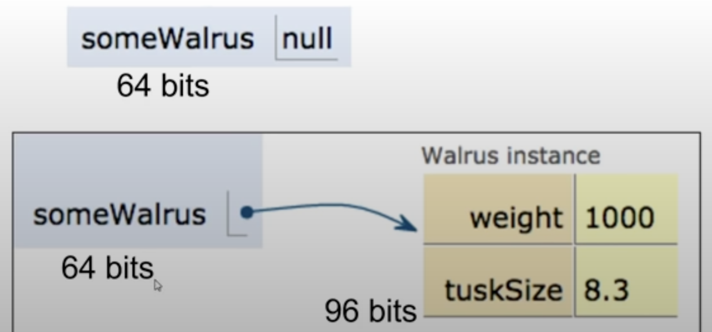

# Data Structure & Algorithm

## Classes, Lists, Arrays, Maps

### Lists in Java

```java
//first import List
import java.util.List;
import java.util.ArrayList;

List L = new List () // ! cannot be instantiated like this, because List is abstract

List<String> L = new ArrayList(); // need to specify the type of elements in the list
L.append('A');
L.append('B');
System.out.ptintln(L); // [A, B]
System.out.println(L.get(0)); // A
```

- Java got bunch of implementations of lists: abstract data types vs. concrete implementations
  > LinkedList, ArrayList, Vector, Stack, Queue, Deque, etc.

### Arrays in Java

- Arrays are not dynamic, need to specify the size of the array
- Array is faster and performant than List, it is more core to the language than List, unlike Python

```java
String [] A = new String[5]; // Need to specify type and size
A[0] = "A";
A[1] = "B";
```

### Maps in Java

- Maps are called dictionaries in Python, which is a collection of key-value pairs.
- Map is also an abstract data type, need to specify the implementation: HashMap, TreeMap, etc.

```java
import java.util.Map;
import java.util.TreeMap;

Map<String, Integer> L = new TreeMap<String, Integer>();
L.put("dog","woof");
L.put("cat","meow");
String sound = L.get("dog"); // map works like list, but with keys instead of indices
System.out.println(sound); // woof

```

## References, Recursion, and Lists

### Reference type in Java

- Declaration: When we declare a variable of a reference type, we are creating a reference to an object of that type (64-bit pointer).
- Instantiation: The instantiation of an object is the creation of an object in memory. The new keyword has a return value, which is a **reference** to the object created. The reference is a pointer to the object in memory. (The memory it takes depends on the instance variables of the object.)
- Box and pointer annotation:
  

#### The golden rule of equals

- Given variables b and a: b = a copies all the bits from a to b
- Passing parameters obeys the same rule: copy all the bits to the new scope, also called pass-by-value
- Be careful when passing reference types, because when you change the object in the new scope, you are changing the object in the old scope as well.

### The IntList class

#### Recursion

> Recursion is a method that calls itself.

> Call stack: the stack of frames that are created when a method is called (stackOverflowError: when the stack is too big)

- Base case: the condition that stops the recursion, to avoid infinite recursion
- Steps to base case: allows the recursion to reach the base case
- Get the size of IntList recursively:

  ```java

  public class IntList {
    public int first;
    public IntList rest;

    public IntList(int f, IntList r) {
      first = f;
      rest = r;
    }

    /** Return the value of the size with recursion*/
    public int size() {
      if (rest == null){
        return 1;
      } else {
        return 1 + rest.size();
      }
    }
    /** Return the value at specific index with recursion */
    public int get(int index) {
      if (index == 0) {
        return first;
      } else return rest.get(index - 1);
    }

    /** Return the value of the size with iteration*/
    public int iterativeSize() {
      IntList p = this;
      int size = 0;
      while (p!=null) {
        size += 1;
        p = p.rest;
      }
    }
    /** Returns an IntList identical to L, but with
      * each element incremented by x. L is not allowed
      * to change. */
    public static IntList incrList(IntList L, int x) {
        if (L.rest == null ) return new IntList(L.first + x, null);
        else return new IntList(L.first + x, incrList(L.rest, x));
    }
    /** Returns an IntList identical to L, but with
      * each element incremented by x. Not allowed to use
      * the 'new' keyword. */
    public static IntList dincrList(IntList L, int x) {
       if (L.rest == null) return new IntList(L.first, null);
       else return new IntList(L.first-x, dincrList(L.rest, x));
    }
    public static void main (String[] args) {
      IntList L = new IntList(15, null);
      L = new IntList(10, L);
      L = new IntList(5, L);
      System.out.println(L.size());
    }
  }
  ```

#### Nested classes

Some classes don't need to stand alone in a separate file, like `IntNode`:

```java
public class SLList {
  public class IntNode {
    public int item;
    public IntNode next;

    public IntNode(int i, IntNode n) {
      item = i;
      next = n;
    }

  }
  public IntNode first;
  public SLList(int x) {
    first = new IntNode(x, null);
  }


  public void addFirst(int x) {
  first =  new IntNode(x, first);
  }

  public int getFirst() {
    return first.item;
  }


  public static void main(String[] args) {
    /* Creates a list of one integer, namely 10 */
    SLList L = new SLList(15);
    L.addFirst(10);
    L.addFirst(5);
    System.out.println(L.getFirst());
  }
}
```

Keywords for nested classes:

- The nested class can access the private variables of the outer class, but not the other way around, nested class can be private.
- If we only need the nested class to be used by the outer class, we can make it private.
- If the nested class doesn't need to access the private variables of the outer class, it's better to make it static, so that it doesn't need to be instantiated in the outer class.

#### Private helper methods

```java
  public void addLast(int x) {
    addLast(first, x);
  }

  private void addLast(IntNode p, int x) {
    if (p.next == null) p.next = new IntNode(x, null);
    else addLast(p.next,x);
  }

  public int size() {
    return size(first);
  }

  private int size(IntNode p) {
    if (p.next == null) return 1;
    else return size(p.next);
  }

```

#### Improve the speed of size()

A much easier way: Initialize the size of the list when the list is created, and update the size when adding or removing elements.

#### The sentinel node to **ensure invariance**

The ugly way of handling the empty list:

```java
  private void addLast(IntNode p, int x) {
    if (p == null) {
      p = new IntNode(x, null);
    }
    else if (p.next == null) p.next = new IntNode(x, null);
    else addLast(p.next,x);
  }

  public int size() {
    return size(first);
  }

  private int size(IntNode p) {
    if (p.next == null) return 1;
    else return size(p.next);
  }
```

Instead of creating a special case for the empty list, we can create a sentinel node that points to the first node of the list. The sentinel node is always there, even when the list is empty.

```java

  private IntNode sentinel;
  private int size;
  public SLList() {
    sentinel = new IntNode(63, null);
    size = 0;
  }

  public SLList (int x) {
    sentinel = new IntNode(63, null);
    sentinel.next = new IntNode(x, null);
    size = 1;
  }


  public void addFirst(int x) {
  sentinel.next = new IntNode(x, sentinel.next);
  size++;
  }

  public int addLast(int x) {
    IntNode p = sentinel;
    while (p.next != null) {
      p = p.next;
    }
    p.next = new IntNode(x, null);
    size++;
  }
```

#### The DLList class

- The DLList class is a doubly linked list, which means that each node has a reference to the previous node as well as the next node.

- In DLList class, we have one sentinal node in both the front and the back of the list, so sentinel.next is the first node of the list, and sentinel.prev is the last node of the list.

```java

public class DLList {
  private IntNode sentinel;
  private int size;
  public DLList() {
    sentinel = new IntNode(63, null, null);
    size = 0;
  }

  public DLList (int x) {
    sentinel = new IntNode(63, null, null);
    sentinel.next = new IntNode(x, sentinel, sentinel);
    size = 1;
  }

  private class IntNode {
    public int item;
    public IntNode next;
    public IntNode prev;

    public IntNode(int i, IntNode n, IntNode p) {
      item = i;
      next = n;
      prev = p;
    }
  }

  public void addFirst(int x) {
    sentinel.next = new IntNode(x, sentinel.next, sentinel);
    size++;
  }

  public int addLast(int x) {
    IntNode p = sentinel;
    while (p.next != null) {
      p = p.next;
    }
    p.next = new IntNode(x, null, p);
    size++;
  }
}
```
